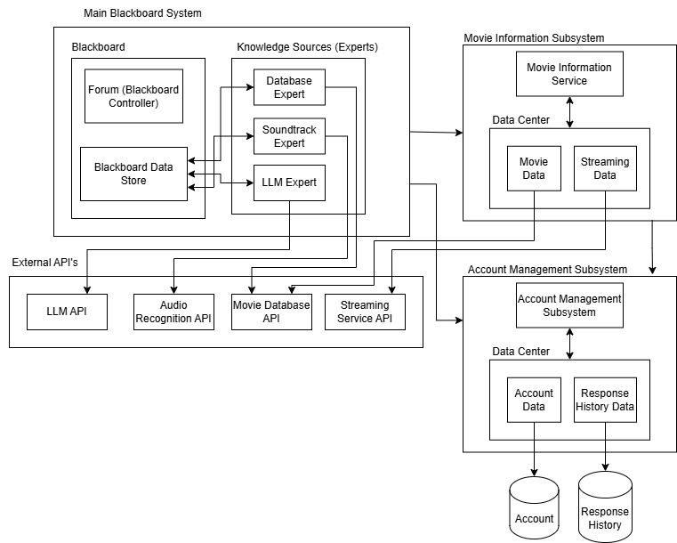

# MovieWhiz

## Quick Demo

[](https://drive.google.com/file/d/1mncp5JkVOMytBVwV69O4Vi9m48VLE-7J/view?usp=sharing)

## Problem Statement

In today's vast sea of streaming content, movie enthusiasts often struggle to recall or rediscover films they once enjoyed or heard about. This can lead to frustration and missed opportunities to engage with potentially beloved cinema. The lack of a simple, intuitive tool to jog memories and provide quick access to information about "forgotten" movies represents a significant gap in the current entertainment landscape.

### Key Objectives

The MovieWhiz mobile application aims to address this problem by providing users with a seamless and engaging experience focused on rediscovering forgotten movies. The key objectives of this project include:

- **Effortless Recall**: Empower users with intuitive input methods (e.g., keywords, descriptions, actor names, soundtrack snippets) to help them identify movies they can't quite remember.
- **Accurate Identification** Leverage LLM's and integrations with movie databases to provide highly accurate movie identifications based on user input.
- **Comprehensive Information**: Offer users quick access to essential details about identified movies, such as title, release year, genre, actors, directors, and plot summaries.
- **Further Exploration**: Facilitate further exploration by providing links to streaming services, trailers, and additional movie information, increasing user engagement with the "forgotten" movie.
- **User-Friendly Interface**: Design an intuitive and visually appealing interface that makes the process of rediscovering movies enjoyable and straightforward.

---

## Requirements and System Design

### Core Workflow of the Application

User logs in or creates an account

User uploads a soundtrack, fills out form fields and/or provides a textual description of the movie based on the information about the movie they recall.

The system processes these inputs and returns a list of candidate movies.

The system then determines the final answer from the list of candidate movies and returns it to user.

Along with the movie name, the system also displays information about the movie and streaming links.

## Requirements

Comprehensive requirements can be found in [docs/Requirements.md](./docs/Requirements.md)

But here is a quick overview:

### Functional requirements

Users can provide three types of input to help identify a movie and each input is handled by a corresponding identification expert:

1. LLM Expert - Users can enter a brief textual description of the movie (e.g., plot summary, key scenes, notable quotes), and the app will use a LLM to identify the movie based on semantic understanding

2. Database Expert - Users can fill out a detailed form with specific information about the movie, such as character names, actor names, genre, release year, or keywords. The system will then cross-reference these inputs with an IMDb database to find the best match.

3. Soundtrack Expert - Users can upload a soundtrack file, and the system will identify the name of the soundtrack. It will then use an IMDb database to match the soundtrack to a movie.

Users have the flexibility to use one, two, or all three input types to improve accuracy. Each expert must report an identified movie along with a confidence score related to that answer if the corresponding input type is entered by the user. The Forum Algorithm, a decision-making model, will analyze the outputs from all available input methods and determine the most accurate movie match. The Forum will output the most accurate movie match, but will prompt the user to enter more information for a more accurate response if the confidence level is low.

Additionally, MovieWhiz will maintain a recorded history section, allowing users to access their past searches and app responses. The app will also support user account management, enabling users to create, edit, and delete profiles.

The innovative feature of the app is that once a movie is correctly identified, the app will display detailed movie information, including streaming availability through partnered streaming services, making it easy for users to watch the identified movie. This structured and multi-faceted approach ensures that MovieWhiz provides a highly accurate, user-friendly, and interactive movie identification experience.

The overall system diagram of the MovieWhiz application is shown below:


### Key Non-Functional Requirements:

- **Reliability**: The system shall remain functional if one input type is not operating properly.
  - Rationale: This allows the system to stay functional and not dependant on a single type of input, allowing users to continue to access services and utilize features. It is important for these services to be independent of one another to maintain functional uptime.
- **Usability**: Users shall be able to understand the app’s interface intuitively and make use of its functionality within 5 minutes.
  - Rationale: Users need to be able to understand how to use the app easily and quickly. Otherwise, users won’t understand how to use the app or won’t bother to learn how to use the app, leading to reduced users.

Overall, the system should be easy to maintain for developers, specifically making it easy to add new experts to the identification process.

## System Architecture

More details about the architecture and why it was chosen can be found in [docs/Architecture.md](./docs/Architecture.md)

Here is a quick overview:

MovieWhiz's overall architecture is a data-centered system, specifically a blackboard-oriented system, reflecting its primary purpose of identifying movies through multiple independent experts. The blackboard architecture supports collaborative problem-solving where different knowledge sources (experts) contribute to a shared solution space.

In addition to a response history database and an account database for storing data about movie responses and user accounts, respectively, the following subsystems exist for this system:

| Subsystem                 | Purpose                           | Architectural Style |
| :------------------------ | :-------------------------------- | :------------------ |
| Account Management        | Manage user accounts and sign-ins | Repository          |
| Movie Information Service | View information on movies        | Repository          |

We selected the blackboard architecture as our primary architectural framework because MovieWhiz's core functionality revolves around solving the complex problem of movie identification through multiple specialized knowledge sources. This architecture excels at problems where:

1. The solution space is large and complex
2. Multiple types of expertise are required
3. Different solution strategies may need to be applied based on the available inputs
4. Partial solutions can be combined to form a complete answer

For example, a user might remember only the name of an actor, a scene description, and part of a soundtrack. The blackboard allows each expert to contribute what it can identify from these different inputs, gradually building toward a complete movie identification.

As described above, this diagram represents the full architecture of the MovieWhiz system:



The class diagram below represents a zoomed in look at the blackboard architecture. As part of the blackboard architecture, this class diagram includes a blackboard, and a blackboard controller, which orchestrates the movie identification process and determines the final answer. Here we also see the subscribe notify pattern being used. All classes that extend the MovieExpertObserver class subscribe to the blackboard which notifies them when new inputs are added by the user. This design makes it very easy to add in a new expert by simply extending the abstract class.


A comprehensive class diagram of the whole system as well as detailed state and sequence diagrams can be found in [docs/DetailedSystemDesign.md](./docs/DetailedSystemDesign.md)

---

## Challenges and Solutions

### Secure Authentication

- **Challenge:** Implementing secure user authentication (login, account creation, and logout) to protect user data and ensure that only authenticated users can access the app's core features.
- **Solution:** We used Firebase Authentication to handle user authentication. Firebase Auth provides robust and secure authentication mechanisms, including features like:
  - Secure storage of user credentials.
  - Built-in security features to prevent common authentication vulnerabilities.
  - This approach significantly reduced development time and ensured a high level of security for user authentication.

### Uploading and Identifying Soundtracks

- **Challenge:** Developing the functionality to allow users to upload audio files on the frontend, transmit those files to the backend, and accurately identify the corresponding soundtracks. Additionally, addressing potential copyright concerns related to storing and distributing audio files.
- **Solution:**
  - We used the `react-native-document-picker` library on the frontend to enable users to select and upload audio files from their devices.
  - On the backend, we employed the `express-multer` middleware to efficiently handle the uploaded audio files.
  - For soundtrack identification, we integrated with the Audd.io API. Audd.io is a powerful music recognition service that can accurately identify songs and soundtracks from audio samples.
  - To mitigate copyright issues, we made a crucial decision **not to store the uploaded soundtracks on our servers**. Instead, we process the audio using the Audd.io API in real-time and only store the identified movie information. This approach minimizes the risk of copyright infringement.

### Movie Database

- **Challenge:** Selecting a comprehensive and reliable database that supports efficient querying to facilitate fast and accurate movie retrieval.
- **Solution:**
  - We opted for an in-house database using Google Cloud Firestore. While Firestore might not be as extensive as a dedicated movie API, it offered several advantages:
    - Efficient querying and indexing capabilities, enabling rapid movie searches.
    - Scalability and reliability, ensuring the database can handle a growing number of users and movie data.
    - Cost-effectiveness, as it allowed us to manage database operations within our budget constraints.
  - The database currently contains information for almost 200 movies.
  - **Future Improvement:** We acknowledge that expanding the database by integrating with a more comprehensive movie API (e.g., IMDb API) would significantly enhance the app's functionality. This remains a key area for future development.

### Calculating Confidence Scores and Forum Algorithm

- **Challenge:** Designing a robust algorithm (the Forum Algorithm) to effectively combine the movie suggestions and confidence scores from the different expert systems (LLM, Database, Soundtrack) to determine the most accurate movie match. The algorithm must also handle ambiguous cases where the user did not input sufficient information to accurately identify a movie.
- **Solution:**
  - We developed the Forum Algorithm, which assigns a priority level to each expert based on its perceived reliability, determined through preliminary testing.
  - **Expert Priority:** The LLM Expert has the highest priority, followed by the Database Expert, and then the Soundtrack Expert.
  - **Confidence Scores:** Each expert returns a list of candidate movies, ordered by their respective confidence scores (highest confidence first).
  - **Summary of Forum Algorithm Logic:**
    - **If the LLM Expert returns a movie:**
      - If the LLM Expert returns only one movie, it is usually selected as the final answer.
      - If the LLM Expert returns multiple movies, the confidence score of the top movie must be at least 20 points higher than the second movie. If this condition is met, the top movie is selected.
      - Otherwise, the algorithm proceeds to consider the Database Expert's results.
    - **If the LLM Expert does not return a movie:** The algorithm directly considers the Database Expert's results.
    - **Database Expert Handling:**
      - If the Database Expert returns a movie with a confidence score higher than a predefined threshold (e.g., 80), that movie is selected.
      - Otherwise, the algorithm considers the Soundtrack Expert's results.
    - **Soundtrack Expert Handling:**
      - If the Soundtrack Expert returns more than 4 movie suggestions, the algorithm requests more information from the user, as the results are likely ambiguous.
      - Otherwise, the first movie suggested by the Soundtrack Expert is selected, and an overall confidence score is calculated as the average of the confidence scores of the Soundtrack Expert's suggestions.
    - **No Expert Returns a Movie:** If none of the experts provide an answer that meets the above conditions, the algorithm requests more information from the user.

## Key Decisions

- **LLM API Selection:**
  - We chose the Gemini API for its strong natural language understanding capabilities, which are crucial for accurately interpreting user descriptions of movies.
- **Audio Format Support:**
  - Initially, we decided to support only MP3 uploads to simplify the implementation and ensure compatibility.
  - **Future Improvement:** We recognize the importance of supporting a wider range of audio formats and enabling users to record audio directly using their phone's microphone. This would enhance the user experience and provide more flexibility in how users interact with the Soundtrack Expert.
- **Movie Database Choice:**
  - We opted for an in-house Firestore database due to cost constraints and the need for efficient querying within a limited dataset.
  - **Future Improvement:** In the future, integrating with a more comprehensive movie database API (e.g., IMDb API) is essential to expand the app's movie coverage and provide more accurate and up-to-date information.

## Implementation Highlights

1. **Blackboard architecture**
   - **Subscribe-Notify Pattern:** A key aspect of our blackboard implementation is the use of the Subscribe-Notify pattern.
     - This pattern enables each expert to "subscribe" to the blackboard.
     - Whenever the user provides new input (e.g., a text description, soundtrack clip, or form data), the blackboard "notifies" the relevant subscribed experts.
     - This ensures that each expert can react to the new information and contribute to the movie identification process in real-time.
     - Furthermore, this design makes it incredibly easy to add new experts to the system in the future. We can simply create a new class that conforms to the expert interface and subscribes to the blackboard. This extensibility is a significant advantage of our architecture.
2. **API Integration**
   - integrate with gemini-2.0-flash using carefully crafted prompt to identify movie based on textual description
   - Integrate with Audd.io API to identify the name of the soundtrack and then query the database to identify the movie name
3. **Firestore database**
   - We utilized Google Cloud Firestore as our primary database to store movie information, user accounts, and search history.

### Key Design Principles

1. **Extensibility**:
   - Prepared for future enhancements (e.g. adding a new expert) with minimal changes to the core structure.
2. **Modularity and Simplicity**:
   - Followed SOLID principles to ensure each class has a single responsibility and is open for extension, not modification.

### Tech Stack Used

#### Backend

- **Programming Language - TypeScript**
  - We chose TypeScript for its strong typing capabilities and object-oriented programming (OOP) support.
- **Express.js**
  - Express.js is a lightweight and flexible Node.js web application framework. We used it to build the backend API for MovieWhiz because it simplifies routing, middleware management, and server-side logic.
- **Deployment of Backend**
  - We used Render to deploy our backend services. Render is a cloud platform that provides easy deployment and scaling of web applications.

#### Frontend

- **React Native**
  - This is a cross-platform mobile development framework that allows us to develop the app efficiently with a single codebase.
- **Expo**
  - Expo provides tools and services that make React Native development easier. We used Expo to simplify the development workflow, including building the APK (Android Package Kit) and managing development tasks.

#### API's

- **Gemini-2.0-flash**
- **Audd.io** for soundtrack identification

#### Database

- **Google Cloud Firestore**
  - We selected Firestore as our NoSQL database for its scalability, real-time capabilities, and flexible data model.

#### Authentication

- **Firebase Auth**

#### Development Tools

- **VS Code**
- **Git and Github**
- **Android Studio**
  - used an Android emulator for testing

## Conclusion

MovieWhiz offers a novel solution to the common problem of movie recall in the age of abundant streaming content. By combining the power of LLMs, specialized expert systems, and a carefully designed architecture, MovieWhiz empowers users to rediscover "forgotten" films through various input methods, including textual descriptions and soundtrack snippets.

The blackboard architecture is a robust foundation, enabling integration of various experts and facilitating future extensibility. Adherence to SOLID principles ensures a maintainable and adaptable codebase.

While the current implementation addresses core movie identification functionality, we recognize the potential for further enhancements. Future development will focus on expanding the movie database, refining the Forum Algorithm, and exploring additional input modalities. We believe that MovieWhiz has the potential to become an indispensable tool for movie enthusiasts, bridging the gap between fragmented memories and cinematic rediscovery.

## How to Run the App

This section provides instructions on how to run the MovieWhiz application, either by using the provided APK or by building your own APK and running the backend locally.

### 1. Using the Provided APK

The pre-built APK (Android Package Kit) can be downloaded from the latest release on the GitHub repository (e.g., Version 1.0.0).

#### Running on an Android Phone:

1.  **Download the APK:** Download the APK file directly to your Android phone.
2.  **Install the APK:**
    - You may need to enable installation from unknown sources in your phone's settings. The exact steps vary depending on your Android version, but generally, you can find this option under:
      - `Settings` \> `Security` or `Settings` \> `Apps` \> `Install unknown apps`
    - Locate the downloaded APK file using a file manager app and tap on it to begin the installation process.
    - Follow the on-screen prompts to complete the installation.
3.  **Open the App:** Once installed, you can open the MovieWhiz app like any other application on your phone.

#### Running on an Android Emulator:

1.  **Install Android Studio:** Download and install Android Studio from the official website ([https://developer.android.com/studio](https://developer.android.com/studio)).
2.  **Create an Android Virtual Device (AVD):**
    - Open Android Studio and create a new virtual device (AVD) through the AVD Manager.
    - Select a device configuration (e.g., Pixel, Nexus) and an Android system image.
    - Ensure that the emulator is configured to your needs (e.g., API level, memory).
3.  **Start the Emulator:** Launch the created AVD. This will start the Android emulator.
4.  **Install the APK:**
    - Drag and drop the downloaded APK file directly onto the running Android emulator window.
    - The emulator will automatically install the application.
5.  **Open the App:** You can then find and open the MovieWhiz app within the emulator.

### 2. Building Your Own APK and Running Backend Locally

This section outlines the steps to build the APK from source code and run the backend server on your local machine.

#### Prerequisites:

- **Node.js and npm (Node Package Manager):** Ensure you have Node.js and npm installed on your system.
- **Android Studio:** Required for building and running the Android emulator (if you choose this method).
- **Expo CLI:** Install the Expo CLI globally using `npm install -g expo-cli`.
- **EAS CLI:** Install the EAS CLI globally using `npm install -g eas-cli`.

#### 2.1 Running the Backend Locally

1.  **Navigate to the Backend Directory:** Open your terminal or command prompt and change the current directory to the backend folder of your project:

    ```bash
    cd backend
    ```

2.  **Install Dependencies:** Install the required Node.js packages:

    ```bash
    npm install
    ```

3.  **Set Environment Variables:** You need to configure the following environment variables. It's highly recommended to use a `.env` file for this, but you can also set them directly in your shell.

    - Create a `.env` file in the backend directory and add the following:

      ```
      GEMINI_API_KEY=YOUR_GEMINI_API_KEY
      AUDD_API_TOKEN=YOUR_AUDD_API_TOKEN
      FIREBASE_SERVICE_ACCOUNT_KEY='{ "type": "...", ... , "private_key": "..." }' # Paste the entire JSON string on one line
      ```

    - **Explanation of Variables:**

      - `GEMINI_API_KEY`: Your API key for the Gemini LLM. Obtain this from the Google Cloud Console.
      - `AUDD_API_TOKEN`: Your API token for the Audd.io music recognition service.
      - `FIREBASE_SERVICE_ACCOUNT_KEY`: The JSON service account key from your Firebase project. This key is necessary for the backend to interact with Firebase services (like Firestore). **Important:** Ensure you paste the entire JSON content of the key file into the `.env` file **on a single line**.

4.  **Run the Backend:** Start the backend server in development mode:

    ```bash
    npm run dev
    ```

    The backend server will typically start on `http://localhost:7000` (or a similar port). Check the console output for the exact URL.

    **Important Note:** If you choose to run the backend locally instead of using the currently deployed version, you will need to manually populate your Firestore database with the movie data that the application relies on. The local backend will not automatically have this data. This data can be found in the `backend/src/data/` folder and can be populated to your database by uncommenting the code in `backend/config/firebaseConfig.ts`

#### 2.2 Frontend Setup

1.  **Navigate to the Frontend Directory:** In your terminal, switch to the frontend directory:

    ```bash
    cd frontend
    ```

2.  **Install Dependencies:** Install the necessary React Native packages:

    ```bash
    npm install
    ```

3.  **Set Environment Variables:**

    - You'll need a `google-services.json` file from your Firebase project to configure Firebase with your Android app.

      - Go to your Firebase project console.
      - Add a new Android app to your project if you haven't already. Use the package name: `com.se3a04.moviewhiz`
      - Download the `google-services.json` file and place it in the `frontend/` directory.

    - Create a `.env` file in the `frontend/` directory and add the following:

      ```
      BACKEND_BASE_URL=http://localhost:7000/api # If running locally
      # or
      BACKEND_BASE_URL=https://moviewhiz.onrender.com/api # If using deployed backend
      ```

4.  **Prebuild the App:** This step prepares your project for building:

    ```bash
    npx expo prebuild
    ```

5.  **Run the App on an Emulator:** Ensure you have an Android emulator running (see "Running on an Android Emulator" above). Then, run:

    ```bash
    npx expo run:android
    ```

    This will build a development version of the app and install it on the running emulator.

6.  **Build Your Own APK:**

    - If you haven't already, install the EAS CLI:

      ```bash
      npm install -g eas-cli
      ```

    - Log in to your Expo account using EAS:

      ```bash
      eas login
      ```

    - Build the APK:

      ```bash
      eas build -p android
      ```

    - EAS will guide you through the build process.

7.  **Download the APK:** Once the build is complete, EAS will provide a link to download the APK. You can also find the build in your Expo account dashboard.
