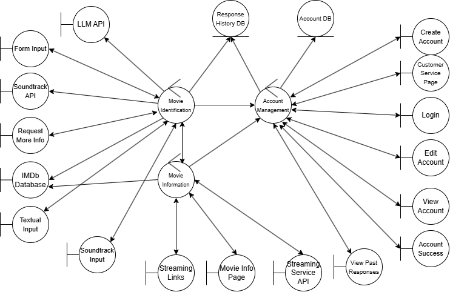
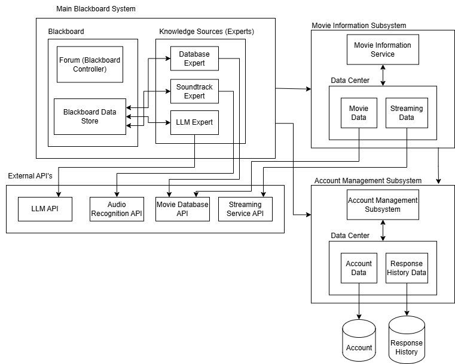

# MovieWhiz: System Architecture

### Note

- Diagrams and screenshots should be placed inside `/docs/uml/`.

## Group Details

- **Team Members:**
  - Ayush Patel
  - Gary Qin
  - Sarah Lum
  - Musbuddin Mondal
  - Michael Padeigis

---

# 1. Introduction

## 1.1 Purpose

This document provides a high level overview of the MovieWhiz system architecture, including high level design considerations of the system and its various subsystems.
This document is intended for internal MovieWhiz stakeholders, including project managers, software developers, domain experts and MovieWhiz investors. MovieWhiz Deliverable 1 should be read prior, and technical knowledge in the software field is useful for a deeper understanding of this document.

## 1.2 Scope

The MovieWhiz system follows a blackboard style architecture as its primary framework, with subsystems following data-centered repository style designs. A blackboard architecture is ideal for the core movie identification functionality as it supports collaborative problem-solving from multiple independent experts working toward a non-deterministic solution. This architecture excels when different knowledge sources (experts) contribute partial solutions to a complex problem with incomplete information.

A repository style architecture was chosen for the Movie Information and Account Management subsystems as it allows efficient management of large amounts of data stored in centralized locations. The Movie Information subsystem retrieves and presents comprehensive movie details once identification is complete, while the Account Management subsystem handles user data and identification history. This architectural approach prioritizes the system's primary goal of movie identification through expert collaboration while providing appropriate data management for supporting functions.

## 1.3 Overview

Section 2 provides an Analysis Class Diagram for MovieWhiz, outlining the structure and relationships of the system's classes. In Section 3, the document delves into the architectural design of the system, exploring various design alternatives and explaining the rationale behind the chosen design decisions. Finally, Section 4 introduces Class Responsibility Collaboration (CRC) Cards, which offer a detailed look into the classes, their responsibilities, and how they interact with one another

# 2. Analysis Class Diagram

# 3. Architectural Design

## 3.1 Overall System Architecture

MovieWhiz's overall architecture is a data-centered system, specifically a blackboard-oriented system, reflecting its primary purpose of identifying movies through multiple independent experts. The blackboard architecture supports collaborative problem-solving where different knowledge sources (experts) contribute to a shared solution space.

In addition to a response history database and an account database for storing data about movie responses and user accounts, respectively, the following subsystems exist for this system:

| Subsystem                 | Purpose                           | Architectural Style |
| :------------------------ | :-------------------------------- | :------------------ |
| Account Management        | Manage user accounts and sign-ins | Repository          |
| Movie Information Service | View information on movies        | Repository          |

Justifications for subsystem architecture choice and subsystem relationships are presented in section 3.2 of this document.

We selected the blackboard architecture as our primary architectural framework because MovieWhiz's core functionality revolves around solving the complex problem of movie identification through multiple specialized knowledge sources. This architecture excels at problems where:

1. The solution space is large and complex
2. Multiple types of expertise are required
3. Different solution strategies may need to be applied based on the available inputs
4. Partial solutions can be combined to form a complete answer

For example, a user might remember only the name of an actor, a scene description, and part of a soundtrack. The blackboard allows each expert to contribute what it can identify from these different inputs, gradually building toward a complete movie identification.

We also considered the other data-centered architecture, repository. However, while it is appropriate for the Account Management and Movie Information Service subsystems where centralized data storage and access patterns are the primary concerns, it is not appropriate for the main system whose core functionality is that of movie identification. The repository architecture lacks the mechanisms for the coordinated problem-solving that movie identification requires.Therefore, it is not suited for the overall architecture of MovieWhiz.

While initially considered for the entire system, we determined MVC is not suitable for the core functionality of collaborative movie identification. MVC excels at separating presentation from business logic but doesn't provide the problem-solving framework needed for integrating multiple expert inputs to solve the complex problem of movie identification, which is the core functionality of this application.

We considered the Presentation-Abstraction-Control (PAC) architectural pattern, which is another interaction oriented architecture. However, we decided against using it for the overall system architecture. While PAC is designed for distributed systems with complex GUIs and multiple interacting agents, MovieWhiz does not require its hierarchical structure, nor is the main concern of MovieWhiz the visualization of different and complex data sources. The blackboard architecture offers a more direct approach to collaborative problem-solving without the overhead of PAC's hierarchical control structure and focus on visualization of different data sources.

We also considered general dataflow architectures, including both pipe and filter and batch sequential, but ultimately found them unsuitable for MovieWhiz. These were rejected for the main architecture as they assume a predefined, sequential flow of data transformations. However, the problem of movie identification is inherently non-linear, with experts potentially contributing in any order depending on the available inputs, and a blackboard architecture is much more suitable for this non-linear collaboration of different experts to solve a complex problem.

We excluded the Process-Control Architecture Style due to its focus on embedded system control, a requirement not present in MovieWhiz.

## 3.2 Subsystems

MovieWhiz has been divided into two distinct subsystems that work together with the main system to deliver the full functionality: Account Management and Movie Information Service.

The Account Management subsystem is responsible for handling all user account-related operations, including registration, login, and profile management. It interacts with the main blackboard system by storing records of movies identified by users. The repository pattern is ideal here because it provides a centralized data storage and retrieval mechanism, ensuring consistent access to user account data. The system's functionality is driven by data transactions, where user actions trigger data updates and retrievals, making the repository's focus on data management perfectly aligned with the subsystem's needs. We considered implementing an MVC pattern for this subsystem but rejected it as it would introduce unnecessary complexity for what is essentially a data-focused service. We evaluated using a pipe and filter architecture but rejected it because it would impose unnecessary sequential processing for what is primarily a system that interacts with a centralized data store. Similarly, a blackboard architecture was deemed excessive since account management doesn't require the collaborative problem-solving approach that is central to the main system.

The Movie Information Service subsystem provides comprehensive movie details, including plot summaries, cast information, streaming links, and ratings. It receives the name of the identified movie from the main blackboard system and queries the IMDb database for information about that movie. It collaborates with a Streaming Service partner to provide the user with streaming links for the movie. It also interacts with the Account Management subsystem to retrieve any promotional offers associated with the current user. The repository pattern is well-suited for this subsystem as it manages a large dataset of movie information. The system's core function is to retrieve and present movie and streaming data, and the repository allows for efficient access to this data, ensuring consistency across the application. This data-driven nature makes the repository style a natural fit. We evaluated using a pipe and filter architecture but rejected it because it would impose unnecessary sequential processing for what is primarily a lookup service. We considered implementing an MVC pattern for this subsystem but rejected it as it would introduce unnecessary complexity for what is essentially a data-focused service. A blackboard architecture was also considered but deemed inappropriate as the subsystem doesn't involve multiple experts collaboratively building a solution, but rather focuses on straightforward data retrieval operations.

# 4. Class Responsibility Collaboration (CRC) Cards

| Class Name: Account Management Controller |                                                                          |
| :---------------------------------------- | :----------------------------------------------------------------------- |
| **Responsibility**                        | **Collaborators**                                                        |
| Handle login request                      | Account Database, Login                                                  |
| Handle account creation for new users     | Account Database, Create Account, Customer Service Page, Account Success |
| Handle viewing of account information     | Account Database, View Account                                           |
| Handle updating of account information    | Account Database, Edit Account                                           |
| Handle viewing of past user responses     | Reponse History Database, Account Database, View Past Responses          |

| Class Name: Movie Identification Controller                                       |                                                          |
| :-------------------------------------------------------------------------------- | :------------------------------------------------------- |
| **Responsibility**                                                                | **Collaborators**                                        |
| Handle soundtrack input                                                           | Soundtrack API Wrapper, Soundtrack Input                 |
| Handle textual input                                                              | LLM API Wrapper, Textual Input                           |
| Handle form input                                                                 | IMDb Database Wrapper, Form Input                        |
| Report most accurate movie to the Movie Information Controller                    | Movie Information Controller                             |
| Store all responses for the current user                                          | Response History Database, Account Management Controller |
| Analyze search results from all available inputs to determine most accurate movie |                                                          |
| Request more information if unable to identify movie                              | Request More Info                                        |

| Class Name: Movie Information Controller                                                    |                                                                                                                |
| :------------------------------------------------------------------------------------------ | :------------------------------------------------------------------------------------------------------------- |
| **Responsibility**                                                                          | **Collaborators**                                                                                              |
| Provide streaming links to the identified movie and promotional offers for the current user | Account Management Controller, Streaming Service API Wrapper, Movie Identification Controller, Streaming Links |
| Provide detailed information about the identified movie                                     | Movie Identification Controller, IMDb Database Wrapper, Movie Info                                             |

| Class Name: Response History Database (Entity)                     |                                                                |
| :----------------------------------------------------------------- | :------------------------------------------------------------- |
| **Responsibility**                                                 | **Collaborators**                                              |
| Successfully insert the userID and response pair into the database | Movie Identification Controller, Account Management Controller |
| Provide efficient retrieval of past responses when requested       | Account Management Controller                                  |
| Knows userID and response                                          |                                                                |

| Class Name: Account Database (Entity)                                           |                               |
| :------------------------------------------------------------------------------ | :---------------------------- |
| **Responsibility**                                                              | **Collaborators**             |
| Successfully insert new users into database if that user does not already exist | Account Management Controller |
| Provide efficient retrieval of user data when requested                         | Account Management Controller |
| Knows user information                                                          |                               |

| Class Name: Create Account (Boundary)          |                               |
| :--------------------------------------------- | :---------------------------- |
| **Responsibility**                             | **Collaborators**             |
| Handles click-event of “Create Account” button | Account Management Controller |
| Displays account creation form                 |                               |
| Knows userId and password                      |                               |

| Class Name: Customer Service Page (Boundary)                                    |                               |
| :------------------------------------------------------------------------------ | :---------------------------- |
| **Responsibility**                                                              | **Collaborators**             |
| Displays customer support options for account and authentication related errors | Account Management Controller |

| Class Name: Login (Boundary)          |                                                      |
| :------------------------------------ | :--------------------------------------------------- |
| **Responsibility**                    | **Collaborators**                                    |
| Displays login form                   |                                                      |
| Handles click-event of “Login” button | Account Management Controller                        |
| Display authentication results        | Account Management Controller, Customer Service Page |

| Class Name: Edit Account (Boundary)                 |                               |
| :-------------------------------------------------- | :---------------------------- |
| **Responsibility**                                  | **Collaborators**             |
| Displays account details for editing                | Account Management Controller |
| Handles user input for updating account information | Account Management Controller |
| Handles user input for updating account information | Account Management Controller |
| Handles click-event of “Save” Button                | Account Management Controller |
| Knows Username                                      |                               |
| Knows Password                                      |                               |
| Knows Gender                                        |                               |
| Knows Date of Birth                                 |                               |

| Class Name: View Account (Boundary)   |                               |
| :------------------------------------ | :---------------------------- |
| **Responsibility**                    | **Collaborators**             |
| Displays User Information             | Account Management Controller |
| Handles click-event of “View Account” | Account Management Controller |

| Class Name: Account Success (Boundary)                |                               |
| :---------------------------------------------------- | :---------------------------- |
| **Responsibility**                                    | **Collaborators**             |
| Handles successful events of saving/creating accounts | Account Management Controller |

| Class Name: View Past Responses (Boundary)          |                               |
| :-------------------------------------------------- | :---------------------------- |
| **Responsibility**                                  | **Collaborators**             |
| Displays history of user’s past responses           | Account Management Controller |
| Handles click-event of “View Past Responses” button | Account Management Controller |

| Class Name: Movie Info (Boundary)                        |                              |
| :------------------------------------------------------- | :--------------------------- |
| **Responsibility**                                       | **Collaborators**            |
| Displays detailed information about the identified movie | Movie Information Controller |

| Class Name: Streaming Links (Boundary)             |                              |
| :------------------------------------------------- | :--------------------------- |
| **Responsibility**                                 | **Collaborators**            |
| Display streaming options for the identified movie | Movie Information Controller |

| Class Name: Soundtrack Input (Boundary)                       |                                 |
| :------------------------------------------------------------ | :------------------------------ |
| **Responsibility**                                            | **Collaborators**               |
| Accepts and process user-uploaded soundtrack                  | Movie Identification Controller |
| Validate audio format and pass data to soundtrack API Wrapper | Soundtrack API Wrapper          |

| Class Name: Form Input (Boundary)      |                                 |
| :------------------------------------- | :------------------------------ |
| **Responsibility**                     | **Collaborators**               |
| Displays form for movie parameters     |                                 |
| Handles click-event of “Submit” button | Movie Identification Controller |

| Class Name: Textual Input (Boundary)                              |                                 |
| :---------------------------------------------------------------- | :------------------------------ |
| **Responsibility**                                                | **Collaborators**               |
| Displays textual input                                            |                                 |
| Handles click-event of “Submit” button for text-based description | Movie Identification Controller |

| Class Name: Request more information (Boundary)           |                                 |
| :-------------------------------------------------------- | :------------------------------ |
| **Responsibility**                                        | **Collaborators**               |
| Display confidence score of 0 and prompt additional input | Movie Identification Controller |

| Class Name: LLM API Wrapper (Boundary)                      |                                 |
| :---------------------------------------------------------- | :------------------------------ |
| **Responsibility**                                          | **Collaborators**               |
| Authenticate and interact with external LLM                 | Movie Identification Controller |
| Handles requests to LLM using the textual input             | Movie Identification Controller |
| Calculate confidence score for API response                 |                                 |
| Returns the response and confidence score to the controller | Movie Identification Controller |

| Class Name: Soundtrack API Wrapper(Boundary)                                                 |                                 |
| :------------------------------------------------------------------------------------------- | :------------------------------ |
| **Responsibility**                                                                           | **Collaborators**               |
| Handles uploaded audio and identifies movie soundtracks                                      | Movie Identification Controller |
| Handles requests to Soundtrack API with audio input                                          | Movie Identification Controller |
| Calculate confidence score for API response                                                  |                                 |
| Returns the resulting soundtrack, corresponding movie and confidence score to the controller | Movie Identification Controller |

| Class Name: IMDb Database Wrapper (Boundary)                              |                                                               |
| :------------------------------------------------------------------------ | :------------------------------------------------------------ |
| **Responsibility**                                                        | **Collaborators**                                             |
| Handles communication with IMDb database and can retrieve essential data. |                                                               |
| Processes search queries using external database                          | Movie Identification Controller, Movie Information Controller |
| Returns retrieved information to the controller                           | Movie Identification Controller, Movie Information Controller |

| Class Name: Streaming Service API Wrapper (Boundary)                                          |                              |
| :-------------------------------------------------------------------------------------------- | :--------------------------- |
| **Responsibility**                                                                            | **Collaborators**            |
| Handles communicating with Streaming Service API to retrieve streaming availability and links | Movie Information Controller |
| Returns valid streaming options and details for identified movies to the controller           | Movie Information Controller |
