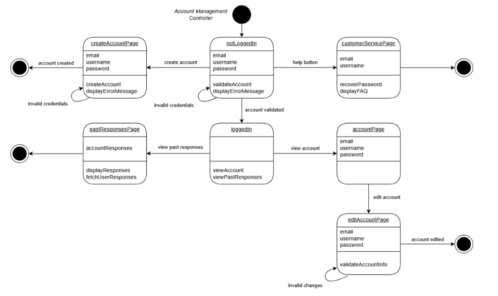
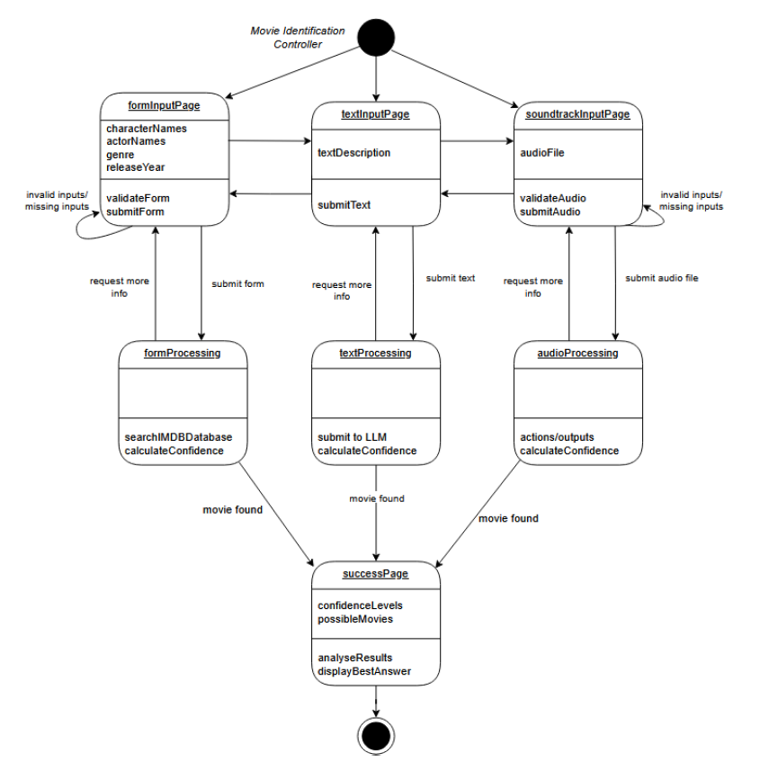
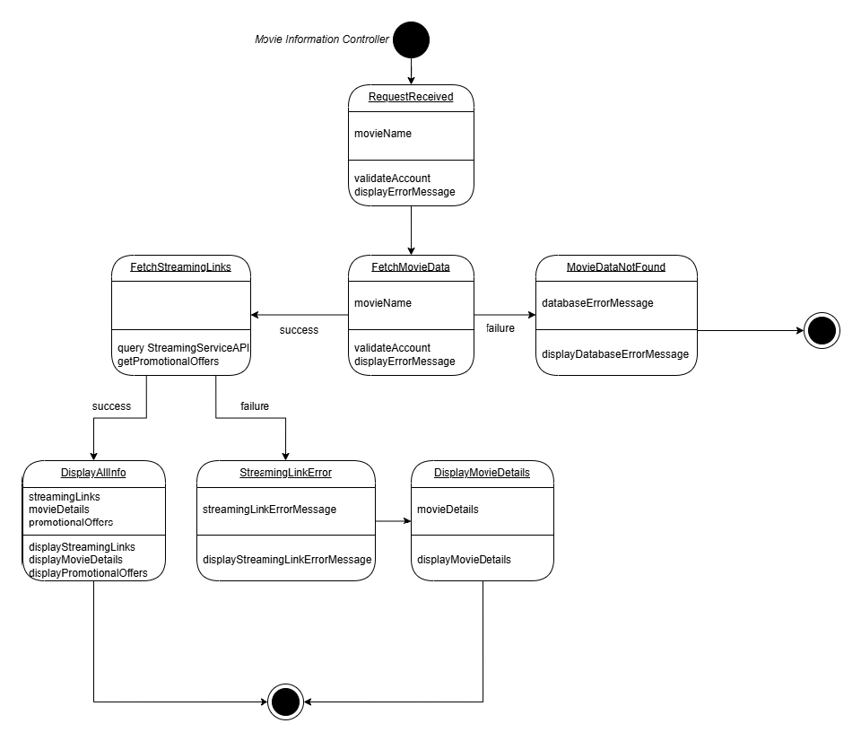
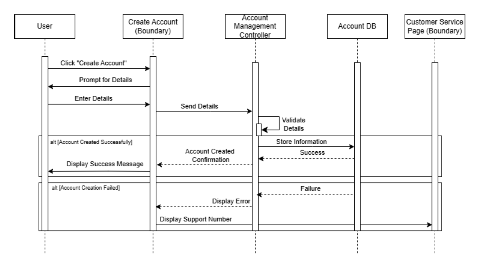
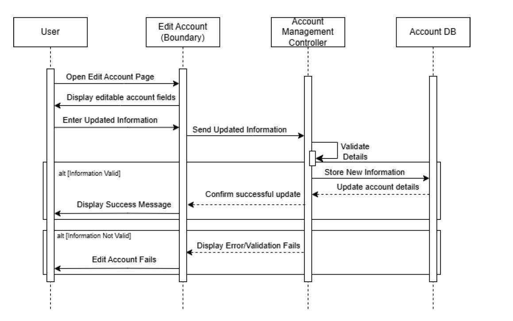
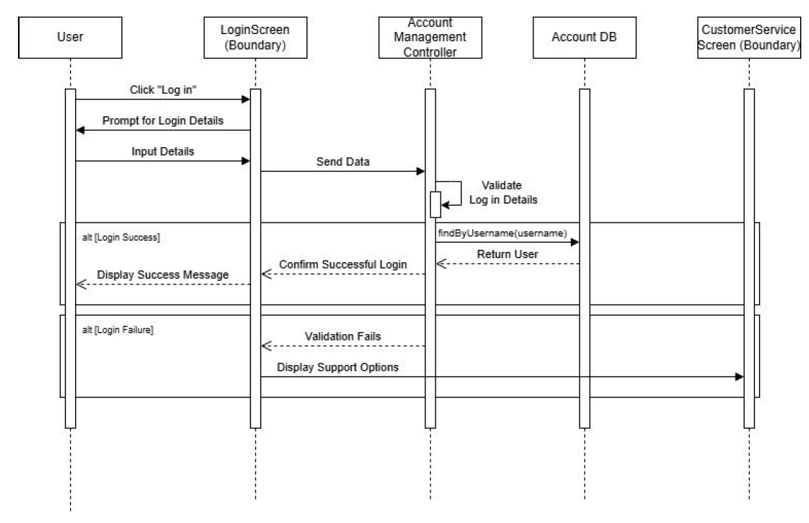
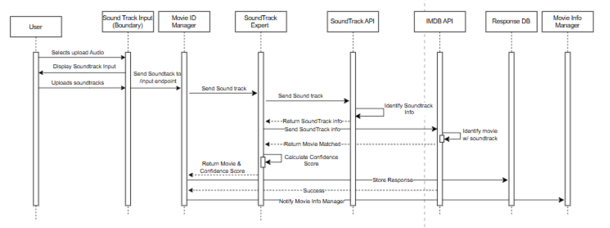
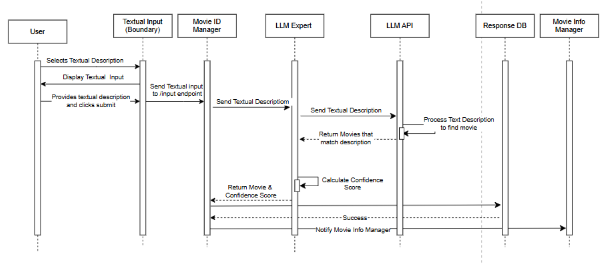
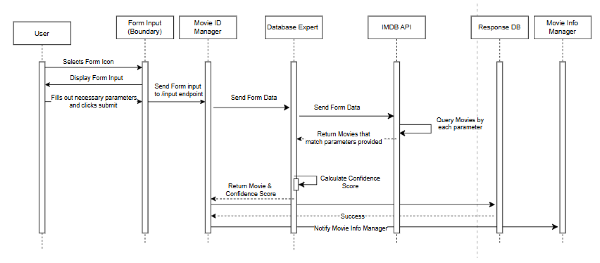
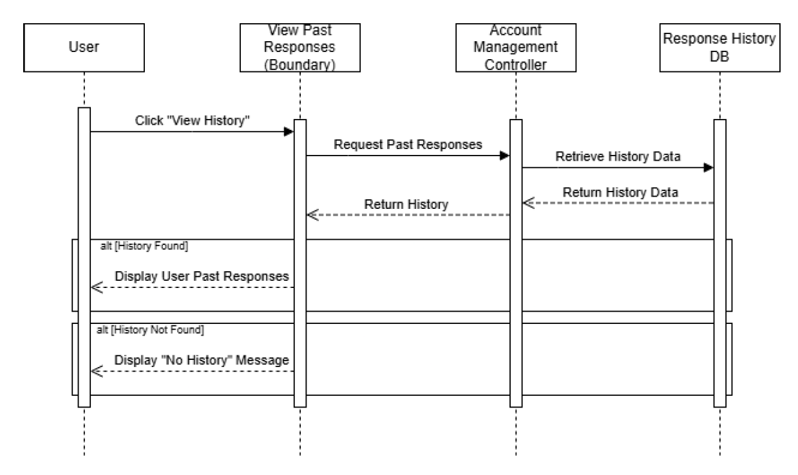

# MovieWhiz: Detailed System Design

### Note

- Diagrams and images should be placed inside `/docs/uml/`.

## Group Details

- **Team Members:**
  - Ayush Patel
  - Gary Qin
  - Sarah Lum
  - Musbuddin Mondal
  - Michael Padeigis

---

# 1. Introduction

## 1.1 Purpose

This document provides an in-depth look into the architecture of the MovieWhiz application, including diagrams illustrating the flow of information and the relationships between different components.

This document is intended for internal MovieWhiz stakeholders, including project managers, developers, and team members.

MovieWhiz Requirements and Architecture documents should be read prior, and technical knowledge in the software field is useful for a deeper understanding of this document.

## 1.2 System Description

An overview of the system description can be found in Architecture.md. This document acts as an extension of Architecture.md, providing more context in form of state diagrams for each controller, sequence diagrams for each use case, and a detailed class diagram.

## 1.3 Overview

This document describes the different diagrams related to MovieWhiz. Section 2 contains the relevant state chart diagrams. Section 3 describes the sequence diagrams. Section 4 provides the detailed class diagram of the system.

# 2. State Charts for Controller Classes

### 2.1 Account Management Controller State Diagram

### 2.2 Movie Identification Controller State Diagram

### 2.3 Movie Information Controller State Diagram

# 3. Sequence Diagrams

### 3.1 Create Account Sequence Diagram

### 3.2 Edit Account Sequence Diagram

### 3.3 Login Sequence Diagram

### 3.4 Upload Soundtrack Sequence Diagram

### 3.5 Textual Description Sequence Diagram

### 3.6 Form Input Sequence Diagram

### 3.7 Response History Sequence Diagram

# 4. Class Diagrams

### 4.1 Detailed Class Diagram

### 4.2 Blackboard Class Diagram

The figure below represents a zoomed in look at the blackboard architecture part of the class diagram:

As part of the blackboard architecture, this class diagram includes a blackboard, and a blackboard controller, which orchestrates the movie identification process and determines the final answer.

Here we also see the subscribe notify pattern being used. All classes that extend the MovieExpertObserver class subscribe to the blackboard which notifies them when new inputs are added by the user. This design makes it very easy to add in a new expert by simply extending the abstract class.
