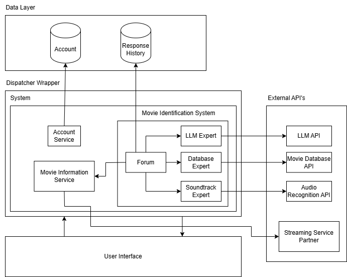

# MovieWhiz: Software Requirements Specification (SRS)

### Note

- Diagrams and images should be placed inside `/docs/uml/`.

## Group Details

- **Team Members:**
  - Ayush Patel
  - Gary Qin
  - Sarah Lum
  - Musbuddin Mondal
  - Michael Padeigis

---

# 1. Introduction

This SRS describes the software requirements for MovieWhiz, a movie identifier application. This document will outline the purpose of MovieWhiz, the scope of the application, functional and non-functional requirements, and a use case diagram..

## 1.1 Purpose

This document focuses on the software requirements, user characteristics, and use cases for MovieWhiz.
This document is intended for internal MovieWhiz stakeholders, including but not limited to, project managers, domain experts, and MovieWhiz team members and investors. No prior readings are required.

## 1.2 Scope

MovieWhiz, a movie identifier application for Android, will allow users to input characteristics of a movie, like the general plot, actors, character names, or soundtrack, which will output the name of the movie they are looking for.

Users are required to register an account on MovieWhiz to access the movie identification service, which includes storing their search history. The service offers three different experts: Search using text description, Search using structured form, and Search using soundtrack. In Search using text description, users can input general plot points or key descriptions of the movie. Using Search using a structured form, the user can fill out a form with available details, such as character names, setting, and actors. In Searching by soundtrack, users upload a short audio clip from a movie soundtrack, which the system will analyze to identify the corresponding movie. If the user enters multiple types of information, all relevant experts contribute to the identification process. A centralized Forum collects responses and confidence levels from experts to determine the most probable movie match. If experts provide conflicting answers, the Forum resolves the conflict.

All search attempts and results are stored in the user’s account, along with user feedback indicating whether the correct movie was identified. This will help improve future searches allowing the system to refine its identification algorithms over time.

The objective of the software is to help users efficiently identify movies they may have forgotten or are unable to recall with limited information. With multiple search options, the software ensures a high accuracy rate in finding the correct movie. The application aims to create a growing database of movie-related information, improving search results through user feedback.
One of the software's goals is to enhance user engagement by providing a seamless and intuitive experience. This includes offering direct links to streaming platforms where the identified movie is available, enabling users to easily watch the movie they searched for. Additionally, the application will provide personalized recommendations, discounts, or promotional offers for streaming services, encouraging users to explore and watch more movies.

## 1.3 Definitions, Acronyms, and Abbreviations

- **Expert:** refers to a specialized module or algorithm designed to analyze specific types of input data to identify a movie. Each expert is tailored to handle a distinct type of information provided by the user
- **LLM:** the Gemini large language model.
- **Movie:** A multimedia entity that is commercially available characterized by attributes like title, plot, actors, characters, setting, genre, release year, and soundtracks.

## 1.4 Overview

Section 2 discusses the overall product description talking about the product perspective, product functions, user characteristics, assumptions and dependencies, and apportioning of requirements.

Section 3 contains the Use Case Diagram for the use case scenario of searching for a movie.

Section 4 contains the highlights of functional requirements talking about main business events and viewpoints.

Section 5 contains the Non-Functional Requirements talking about Look and Feel Requirements, Usability and Humanity Requirements, Performance Requirements, Operational and Environmental Requirements, Maintainability and Support Requirements, Security Requirements, Cultural and Political Requirements, and Legal Requirements.

---

# 2. Overall Product Description

## 2.1 Product Perspective

MovieWhiz is a movie identification app developed for the Android platform. It shares similarities with Shazam, which identifies movies and music based on a short audio sample. However, MovieWhiz is primarily focused on identifying movies, offering users multiple input methods to increase identification accuracy.

Users can provide three types of input to help identify a movie and each input is handled by a corresponding identification expert:

1. LLM Expert - Users can enter a brief textual description of the movie (e.g., plot summary, key scenes, notable quotes), and the app will use a LLM to identify the movie based on semantic understanding

2. Database Expert - Users can fill out a detailed form with specific information about the movie, such as character names, actor names, genre, release year, or keywords. The system will then cross-reference these inputs with an IMDb database to find the best match.

3. Soundtrack Expert - Users can upload a soundtrack file, and the system will identify the name of the soundtrack. It will then use an IMDb database to match the soundtrack to a movie.

Users have the flexibility to use one, two, or all three input types to improve accuracy. Each expert must report an identified movie along with a confidence score related to that answer if the corresponding input type is entered by the user. The Forum Algorithm, a decision-making model, will analyze the outputs from all available input methods and determine the most accurate movie match. The Forum will output the most accurate movie match, but will prompt the user to enter more information for a more accurate response if the confidence level is low.

Additionally, MovieWhiz will maintain a recorded history section, allowing users to access their past searches and app responses. The app will also support user account management, enabling users to create, edit, and delete profiles.

The innovative feature of the app is that once a movie is correctly identified, the app will display detailed movie information, including streaming availability through partnered streaming services, making it easy for users to watch the identified movie. This structured and multi-faceted approach ensures that MovieWhiz provides a highly accurate, user-friendly, and interactive movie identification experience.

The overall system diagram of the MovieWhiz application is shown below:

## 2.2 Product Functions

There will be 3 modules in the product: the Movie Identification System, Account Service and Movie Streaming Service. The Movie Identification System has a sub module called the Forum, which is responsible for analyzing search results, reporting the most accurate answer and requesting additional information if needed. The Movie Identification System also contains three sub modules that are experts. Each expert is responsible for calculating the confidence score of its response. The Soundtrack Expert can search using a soundtrack. The LLM Expert can search using textual description. The Database Expert can search using structured forms. The Movie Information Service (innovative feature) is responsible for displaying movie information once identified by the Forum and providing links to stream movies. Within the Account service, there are functions of creating, editing accounts, and logging in.

| Modules                     | Functions                                                                                                                               |
| :-------------------------- | :-------------------------------------------------------------------------------------------------------------------------------------- |
| Movie Identification System | Search using text, soundtrack and structured forms; Calculate confidence scores and determine right answer                              |
| Account Service             | Create Account, Edit Account, Login and logout                                                                                          |
| Movie Information Service   | Display detailed information about the movie Provide links to partnered streaming services, making it easy for users to watch the movie |

The figure below shows a state diagram demonstrating how the system behaves in response to user events:

## 2.3 User Characteristics

- **Occasional Movie Watchers:** Basic literacy, low tech expertise.
- **Film Enthusiasts:** Intermediate to advanced technical and film knowledge.
- **Music Fans:** Moderate technical skills.

## 2.4 Constraints

- Reliance on IMDb and third-party LLM APIs.
- The system is constrained with any copyright law associated with each audio track. The system may be legally obliged to not store or redistribute some audio tracks.
- The system will be created under a very short time constraint, this may cause implementation of only basic features with the project's timeline and no budget funding.

## 2.5 Assumptions and Dependencies

- System assumes accurate user input.
- Works only with IMDb-listed movies.
- Relies on external APIs and databases.

## 2.6 Apportioning of Requirements

- English-only language support initially.
- Initial database limited to Top 100 Box Office movies.

---

# 3. Use Case Diagram

---

# 4. Highlights of Functional Requirements

**Main Business Events**

- **BE1:** Create Account
- **BE2:** Edit Account
- **BE3:** Login
- **BE4:** Upload Soundtrack
- **BE5:** Provide Textual Description
- **BE6:** Provide Structured Form Inputs
- **BE7:** Get Accurate Movie Match
- **BE8:** View Search History

**Viewpoints Considered**

- **VP1:** User
- **VP2:** Customer Support
- **VP3:** Streaming Partner
- **VP4:** Marketing Team
- **VP5:** Advertisement Manager

## BE1. Create Account #1

**Pre-condition:** User does not have an existing account.

### VP1. User #1

**Main Success Scenario:**

1. The user opens the app
2. The system prompts the user to enter required details.
3. System verifies the information and activates the account.

**Secondary Scenario:**

- 2i. User does not enter in all required fields.
  - 2i.1. System prompts the user to fill all required fields.
- 3i. User information is not valid
  - 3i.1. System cannot activate the new account
  - 3i.2. Account creation fails.

### VP2. Customer Support #2

1. System should display a customer support number if account creation fails.

### VP3. Streaming Service Partner #3

1. System should prompt the user to agree to receive promotions from the streaming service.

### VP4. Marketing #4

1. If the user joined from a referral link, the system updates the backend data collection.

### VP5. Advertisement Manager #5

- N.A.

### Global Scenario:

**Pre-condition:** The user does not have an existing account.

**Main Success Scenario:**

1. The user opens the app.
2. The system prompts the user to enter required details.
3. User inputs all required fields for registration.
4. The system prompts the user to opt in for receiving promotions from the streaming service.
5. The system verifies the information and activates the account.
6. If the user opts in for promotions, the streaming service is notified of a new account creation.
7. If the user joined from a referral link, the system updates the backend data collection.

**Secondary Scenario:**

- 3i. User does not enter in all required fields.
  - 2i.1. System prompts the user to fill all required fields.
  - 2i.2. Return to BE1.VP1.3
- 5i. User information is not valid
  - 5i.1. System cannot activate the new account
  - 5i.2. Account creation fails.
  - 5i.3. System displays the customer support number.

---

## BE2. Edit an account #2

**Pre-condition:** User must have an existing account.

### VP1. User #1

**Main Success Scenario:**

1. System displays input fields for the user to edit personal details.
2. User enters relevant, updated information and presses “Confirm”.
3. System validates the user’s new information.
4. System updates the user’s new information.

**Secondary Scenario:**

- 2i. User inputs invalid information.
  - 2i.1. System fails to validate the user’s new information.
  - 2i.2. Error message is displayed, edit account fails.

### VP2. Customer Support #2

- N/A

### VP3. Streaming Service Partner #3

- N/A

### VP4. Marketing Team #4

- N/A

### VP5. Advertisement Team #5

- N/A

### Global Scenario:

**Pre-condition:** User must have an existing account.

**Main Success Scenario:**

1. System displays input fields for the user to edit personal details.
2. User enters relevant, updated information and presses “Confirm”.
3. System validates the user’s new information.
4. System updates the user’s new information.

**Secondary Scenario:**

- 2i. User inputs invalid information.
  - 2i.1. System fails to validate the user’s new information.
  - 2i.2. Edit account fails.

---

## BE3. Login to the app #3

**Pre-condition:** User must have an existing account.

### VP1. User #1

**Main Success Scenario:**

1. System displays input fields for the user to input login information.
2. User enters relevant information and presses “Continue”.
3. System validates the user’s information.
4. System proceeds to the home page if the user’s information is correct.

**Secondary Scenario:**

- 2i. User inputs invalid information.
  - 2i.1. System fails to validate the user’s login information.
  - 2i.2. Log-in fails, display error message.

### VP2. Customer Support #2

1. System displays an option to help recover the user account.

### VP3. Streaming Service Partner #3

- N/A

### VP4. Marketing Team #4

- N/A

### VP5. Advertisement Team #5

1. System renders advertisements in the bottom 20% of the page and updates the backend data collection to indicate that the user viewed the advertisements.

### Global Scenario:

**Pre-condition:** User must have an existing account.

**Main Success Scenario:**

1. System displays input fields for the user to input login information.
2. User enters relevant information and presses “Continue”.
3. System validates the user’s information.
4. System proceeds to the home page if the user’s information is correct.
5. System renders advertisements in the bottom 20% of the homepage, and updates the backend data collection to indicate that the user viewed the advertisements.

**Secondary Scenario:**

- 1i. System displays option to create an account.
  - 1i.1. User clicks option to create an account.
  - 1i.2. User is directed to create an account (BE1.2)
- 1ii. System displays option to recover account.
  - 1ii.1. User clicks option to recover account.
  - 1ii.2. User is redirected to a screen with various recovery options.
- 2i. User inputs invalid information.
  - 2i.1. System fails to validate the user’s login information.
  - 2i.2. Log-in fails, display error message.

---

## BE4. Upload soundtrack #4

**Pre-condition:** User is connected to the internet and has an MovieWhiz Account

### VP1. User #1

**Main Success Scenario:**

1.  User wishes to identify a movie by soundtrack
2.  User opens the application and navigates to the “Find a Movie” section
3.  User selects the “Upload Soundtrack” icon and browses for a audio clip from their device
4.  User uploads the audio clip.
5.  System passes the audio clip to the Soundtrack expert for identification.
6.  Within the Soundtrack Expert, Audio Recognition API is used to identify the name of the soundtrack.
7.  If the name of the soundtrack is identified, IMDb database API is used.to match the soundtrack to movies that contained that soundtrack.
8.  If only one movie match is found, that movie is reported to the Forum as the Soundtrack expert’s answer along with a very high confidence score.

**Secondary Scenario:**

- 4i. User uploads a audio clip that is an unsupported format
  - 4i.1. System detects the unsupported file and fails to process the audio clip
  - 4i.2. System displays an error message telling them the issue and prompting them to upload the audio file in a supported file format.
- 7i. Name of the soundtrack cannot be identified
  - 7i.1. Soundtrack expert reports to the Forum that the movie could not be identified along with a confidence score of 0%.
- 8i. More than one movie match is found
  - 8i.1. If one of the movies is at least twice as popular as all the other matched movies, the Soundtrack expert reports that movie as the answer to the Forum along with a high confidence score.
  - 8i.2. Otherwise, the Soundtrack expert reports the most popular movie as the answer, but with a low confidence score.

### VP2. Customer Support #2

- N/A

### VP3. Streaming Service Partner #3

- N/A

### VP4. Marketing Team #4

- N/A

### VP5. Advertisement Team #5

- N/A

### Global Scenario:

**Pre-condition:** User is connected to the internet and has an MovieWhiz Account

**Main Success Scenario:**

1.  User wishes to identify a movie by soundtrack
2.  User opens the application and navigates to the “Find a Movie” section
3.  User selects the “Upload Soundtrack” icon and browses for a audio clip from their device
4.  User uploads the audio clip.
5.  System passes the audio clip to the Soundtrack expert for identification.
6.  Within the Soundtrack Expert, Audio Recognition API is used to identify the name of the soundtrack.
7.  If the name of the soundtrack is identified, IMDb database API is used.to match the soundtrack to movies that contained that soundtrack.
8.  If only one movie match is found, that movie is reported to the Forum as the Soundtrack expert’s answer along with a very high confidence score.

**Secondary Scenario:**

- 4i. User uploads a audio clip that is an unsupported format
  - 4i.1. System detects the unsupported file and fails to process the audio clip
  - 4i.2. System displays an error message telling them the issue and prompting them to upload the audio file in a supported file format.
- 7i. Name of the soundtrack cannot be identified
  - 7i.1. Soundtrack expert reports to the Forum that the movie could not be identified along with a confidence score of 0%.
- 8i. More than one movie match is found
  - 8i.1. The movie popularity is used to resolve this conflict. If one of the movies is at least twice as popular as all the other matched movies, the Soundtrack expert reports that movie as the answer to the Forum along with a high confidence score. Otherwise, the Soundtrack expert reports the most popular movie as the answer, but with a low confidence score.

---

## BE5. Provide a Textual Description of a Movie #5

**Pre-condition:** User is connected to the internet and has an MovieWhiz Account

### VP1. User #1

**Main Success Scenario:**

1.  User wishes to identify a movie by textual description
2.  User opens the application and navigates to the “Find a Movie” section
3.  User enters a detailed description about the movie they wish to identify.
4.  System passes the input to the LLM expert for identification.
5.  Within the LLM expert, the movie description is passed to the Deep Seek R1 API along with the following prompt “Using the provided description, identify which movie it is referring to. If you cannot confidently identify the movie, return 'no confidence’”.
6.  If the LLM returns a movie name, that movie name is reported to the Forum as the answer with a very high confidence score.

**Secondary Scenario:**

- 5i. Deepseek R1 LLM API is not working
  - 5i.1. LLM expert reports to the Forum that the movie could not be identified along with a confidence score of 0% to the user.
- 6i. LLM API returns ‘no confidence’
  - 6i.1. LLM expert reports to the Forum that the movie could not be identified along with a confidence score of 0%.

### VP2. Customer Support #2

- N/A

### VP3. Streaming Service Partner #3

- N/A

### VP4. Marketing Team #4

- N/A

### VP5. Advertisement Team #5

- N/A

### Global Scenario:

**Pre-condition:** User is connected to the internet and has an MovieWhiz Account

**Main Success Scenario:**

1.  User wishes to identify a movie by textual description
2.  User opens the application and navigates to the “Find a Movie” section
3.  User enters a detailed description about the movie they wish to identify.
4.  System passes the input to the LLM expert for identification.
5.  Within the LLM expert, the movie description is passed to the Deep Seek R1 API along with the following prompt “Using the provided description, identify which movie it is referring to. If you cannot confidently identify the movie, return 'no confidence’”.
6.  If the LLM returns a movie name, that movie name is reported to the Forum as the answer with a very high confidence score.

**Secondary Scenario:**

- 5i. LLM API is not working
  - 5i.1. LLM expert reports to the Forum that the movie could not be identified along with a confidence score of 0%.
- 6i. LLM API returns ‘no confidence’
  - 6i.1. LLM expert reports to the Forum that the movie could not be identified along with a confidence score of 0%.

---

## BE6. Provide parameters for a form #6

**Pre-condition:** User is connected to the internet and has an MovieWhiz Account

### VP1. User #1

**Main Success Scenario:**

1.  User wishes to identify a movie by filling in structured form fields.
2.  User opens the application and navigates to the “Find a Movie” section
3.  User selects the “Fill out form” icon.
4.  System displays the structured form with movie parameters such as actor, character, names, release date, etc.
5.  User fills out the form with as many of the fields that they know and submits it.
6.  System processes the form and passes the form data to the Database expert for identification.
7.  Within the Database expert, IMDb database API is used to match the form data to a movie in the IMDb database.
8.  If exactly one movie is a match, that movie is reported to the Forum as the Database expert’s answer along with a very high confidence score.

**Secondary Scenario:**

- 5i. User submits the form without filling in any form fields.
  - 5i.1. System detect insufficient parameters
  - 5i.2. System prompts the user to input at least 1 parameter.
- 7i. IMDB database API is unavailable.
  - 7i.1. Database expert reports to the Forum that the movie could not be identified along with a confidence score of 0%.
- 8i. No movie in the database is a match.
  - 8i.1. Database expert reports to the Forum that the movie could not be identified along with a confidence score of 0%.
- 8j. More than one movie is a match.
  - 8j.1. The movie popularity is used to resolve this conflict. If one of the movies is at least twice as popular as all the other matched movies, the Database expert reports that movie as the answer to the Forum along with a high confidence score. Otherwise, the Database expert reports the most popular movie as the answer, but with a low confidence score.

### VP2. Customer Support #2

- N/A

### VP3. Streaming Service Partner #3

- N/A

### VP4. Marketing Team #4

- N/A

### VP5. Advertisement Team #5

- N/A

### Global Scenario:

**Pre-condition:** User is connected to the internet and has an MovieWhiz Account

**Main Success Scenario:**

1.  User wishes to identify a movie by filling in structured form fields.
2.  User opens the application and navigates to the “Find a Movie” section
3.  User selects the “Fill out form” icon.
4.  System displays the structured form with movie parameters such as actor, character, names, release date, etc.
5.  User fills out the form with as many of the fields that they know and submits it.
6.  System processes the form and passes the form data to the Database expert for identification.
7.  Within the Database expert, IMDb database API is used to match the form data to a movie in the IMDb database.
8.  If exactly one movie is a match, that movie is reported to the Forum as the Database expert’s answer along with a very high confidence score.

**Secondary Scenario:**

- 5i. User submits the form without filling in any form fields.
  - 5i.1. System detect insufficient parameters
  - 5i.2. System prompts the user to input at least 1 parameter.
- 7i. IMDB database API is unavailable.
  - 7i.1. Database expert reports to the Forum that the movie could not be identified along with a confidence score of 0%.
- 8i. No movie in the database is a match.
  - 8i.1. Database expert reports to the Forum that the movie could not be identified along with a confidence score of 0%.
- 8j. More than one movie is a match.
  - 8j.1. The movie popularity is used to resolve this conflict. If one of the movies is at least twice as popular as all the other matched movies, the Database expert reports that movie as the answer to the Forum along with a high confidence score. Otherwise, the Database expert reports the most popular movie as the answer, but with a low confidence score.

---

## BE7. User wants to get the most accurate movie match #7

**Pre-condition:** The system has received at least one input (text, structured parameters, or audio)

The experts have processed the input and returned results with a confidence level

### VP1. User #1

**Main Success Scenario:**

1.  The Forum algorithm collects and organizes the responses from experts
2.  The Forum compares the confidence scores given from the experts
3.  If multiple experts provide the same answer, the Forum automatically knows the movie match.
4.  If multiple experts provide conflicting results, the Forum resolves the conflict through comparing confidence levels
5.  If one expert has a significantly higher confidence, the Forum selects that movie match
6.  If the confidence is too low and the user has only provided one input, the Forum can request additional information about the movie
7.  The system looks through streaming platform databases to determine where the matched movie can be watched
8.  The Forum outputs the final movie match with a confidence level and streaming availability

**Secondary Scenario:**

- 2i. All experts report a confidence score of 0%.
  - 2i.1 The Forum notifies the user that no match was found and suggest refining the input
- 6i. Confidence score for all experts is below a set threshold
  - 6i.1 The Forum still reports the most accurate match but prompts the user for additional details for better accuracy.

### VP2. Customer Support #2

- 2i.2 System should prompt an error page with suggestions that the user could follow with a provided link that connects to customer support

### VP3. Streaming Service Partner #3

**Main Success Scenario:**

1.  The system looks through streaming platform databases to determine where the matched movie can be watched
2.  The system retrieves the streaming availability details (ex. platform name, rental/purchase options, region availability)
3.  The Forum returns streaming availability information along with the movie match

**Secondary Scenario:**

- 8i. No streaming service has the movie
  - 8i.1 The Forum notifies the user that no streaming options are available.
  - 8i.2 The system suggests alternative actions (e.g., checking back later, renting/purchasing, or refining input).

### VP4. Marketing Team #4

- N/A

### VP5. Advertisement Team #5

- N/A

### Global Scenario:

**Precondition:** The system has received at least one input (text, structured parameters, or audio)

The experts have processed the input and returned results with a confidence level

**Main Success Scenario:**

1.  The system sends expert responses to Forum algorithm
2.  The Forum algorithm collects and organizes the responses from experts
3.  The Forum compares the confidence scores given from the experts
4.  If multiple experts provide the same answer, the Forum automatically knows the movie match
5.  If multiple experts provide conflicting results, the Forum resolves the conflict through comparing confidence levels
6.  If one expert has a significantly higher confidence, the Forum selects that movie match
7.  If the confidence is too low and the user has only provided one input, the Forum can request additional information about the movie
8.  The system find a movie match with available streaming services
9.  The Forum outputs the final movie match with a confidence level and streaming availability

**Secondary Scenario:**

- 2i. No expert provides a valid response
  - 2i.1 The Forum notifies the user that no match was found and suggest refining the input
  - 2i.2 System should prompt an error page with suggestions that the user could follow with a provided link that connects to customer support
- 7i. Confidence score for all experts is below a set threshold
  - 7i.1 The Forum still reports the most accurate match but prompts the user for additional details for better accuracy.
- 8i. No streaming service has the movie
  - 8i.1 The Forum notifies the user that no streaming options are available.
  - 8i.2 The system suggests alternative actions (e.g., checking back later, renting/purchasing, or refining input).

---

# 5. Non-Functional Requirements

## Look and Feel Requirements

### Appearance Requirements

- LF-A1. The system shall use colours that align with MovieWhiz’s brand colours.

  - Rationale: The system’s colors will be clearly associated with the MovieWhiz brand to establish the app as a trustworthy, reliable and safe one.

- LF-A2. The system must avoid using bright and saturated colours as backgrounds on any screen

  - Rationale: The system must not be distracting with its design because it could easily overwhelm users and make the app more difficult to use.

- LF-A3. The system shall have a minimalist design

  - Rationale: A simple and uncluttered design will improve usability, allowing users to focus on the movie identification system, rather than understanding complicated menus.

- LF-A4. The system shall display buttons in uniform colours

  - Rationale: Buttons must be easily distinguishable and intuitive to indicate interactive elements. Using consistent colours will indicate to users where they may interact.

- LF-A5. The system’s buttons and menus must contrast in colour

  - Rationale: Buttons must be easy to differentiate from the background to identify actionable elements, improving user accessibility.

- LF-A6. The system must use 1 consistent font choice (Sans-Serif) in the app

  - Rationale: The system should have a consistent Sans-Serif font to make the app easily readable and easy to navigate.

- LF-A7. The system uses animations and transitions sparingly

  - Rationale: The system uses subtle animations to improve engagement, but excessive effects can distract users and slow down the app.

- LF-A8. The system must follow accessibility guidelines for contrast and font size
  - Rationale: Sufficient contrast ratios, scalable font sizes, and text to speech capabilities, allows the app to be more inclusive for users with impairments.

### Style Requirements

- LF-S1. The system must indicate ongoing movie search process through a visual cue, such as a loading graphic

  - Rationale: Users should be aware that the app is actively processing their movie input to find a corresponding match. A loading graphic will allow the user to differentiate whether the app is actually working.

- LF-S2. The system must display external data sources and companies using their official logos, branding and colouring.

  - Rationale: Users should be able to distinguish verified data sources, ensuring trustworthy answers to users regarding streaming availability and information.

- LF-S3. The system must not display more than 6 buttons on a single page

  - Rationale: Too many buttons on a single page can overwhelm and confuse users. Additional features like menus, tabs and collapsible sections can be added for a more structured experience.

- LF-S3. The system must scale properly to different screens and resolutions

  - Rationale: The app should adapt easily to different Android devices, ensuring a consistent user experience across screen sizes and resolutions. Users will easily be able to adapt to different Android devices as design will stay consistent

- LF-S4. The system must have a uniform navigation feature across all screens

  - Rationale: Consistent placement of navigation features, such as buttons for back, home and search, allows for an intuitive user experience and reduces confusion.

- LF-S5. The system must display search results in a structured and visually distinct format

  - Rationale: Identified movies should be displayed with a clear layout to prevent clutter and enhance readability.

- LF-S6. The system must maintain consistent spacing and alignment between UI elements
  - Rationale: Proper margins, padding and a grid based layout ensures a clean and professional appearance, indicating a trustworthy app for users.

## Usability and Humanity Requirements

### Ease of Use Requirements

- UH-EOU1. The system must allow users to report bugs within the app.

  - Rationale: Users must be able to report bugs they encounter while using the app to inform the developers. This allows the developer team to make changes and fixes, leading to improved app performance and usability.

- UH-EOU2. Buttons, and input fields must be appropriately sized for touch interaction.
  - Rationale: Users must not experience any difficulty interacting with the components of the app. Otherwise, users would find the app annoying to use, and it would hurt the app’s usability and user experience.

### Personalization and Internationalization Requirements

- UH-PI1. The system must allow users to specify the app’s language, from a selection of the top 10 most popular languages for localisation (German, French, Spanish, Italian, Dutch, Polish, Russian, Portuguese, Swedish, Japanese) \[1].
  - Rationale: Users must be able to understand the language that the app is in. Otherwise, the app would be unusable for people who don’t speak any of the languages the app supports.

### Learning Requirements

- UH-L1. Users shall be able to understand the app’s interface intuitively and make use of its functionality within 5 minutes.
  - Rationale: Users need to be able to understand how to use the app easily and quickly. Otherwise, users won’t understand how to use the app or won’t bother to learn how to use the app, leading to reduced users.

### Understandability and Politeness Requirements

N.A.

### Accessibility Requirements

- UH-A1. The system must adhere to WCAG 2 contrast and colour requirements \[2].
  - Rationale: The system’s use of contrast and colour must be inclusive to those with visual impairments, aiming for the AA level of conformance according to the WCAG 2 \[2]. Otherwise, certain features of the application could be imperceivable to people with visual impairments.

## Performance Requirements

### Speed and Latency Requirements

- PR-SL1. The system shall provide movie identification and confidence score results within 5 seconds of a search for 90% of standard requests.
  - Rationale: It is important for the system to provide efficient and positive user experience to be able to grow a community of returning users. Some input file sizes and internet connectivity may vary, which is why 90% of standard requests must adhere to this requirement.

### Safety-Critical Requirements

- PR-SC1. The system shall notify and document all critical errors to the support team.
  - Rationale: This will allow the system to have high quality maintenance service with rapid response times.

### Precision or Accuracy Requirements

- PR-PA1. Form and LLM algorithm shall achieve a minimum of 90% matching accuracy for movies with at least 10000 user votes on IMDb when clear input is provided.

  - Rationale: This ensures reliable identification and additional information for most of the popular movies in the IMDb database.

- PR-PA2. Audio inputs of 15 seconds or more from an official soundtrack should be accurately identifiable with at least 85% confidence.

  - Rationale: Audio inputs of decent length should contain enough information to recognize important information from the file most of the time.

- PR-PA3. Confidence score shall align to ± 5% margin of true accuracy.
  - Rationale: This requirement will help guarantee the confidence accuracy being displayed to the user. For example, it is important to tell users that the result has 90% confidence of accuracy and that the resultant movie actually has about an 85%-95% chance of being the correct one.

### Reliability and Availability Requirements

- PR-RA1. The system’s services shall maintain a 99.9% uptime rate every month.
  - Rationale: This will ensure consistency with the service being provided to the users and maintain reliability and satisfaction.

### Robustness or Fault-Tolerance Requirements

- PR-RFT1. The system shall remain functional if one input type is not operating properly.
  - Rationale: This allows the system to stay functional and not dependant on a single type of input, allowing users to continue to access services and utilize features. It is important for these services to be independent of one another to maintain functional uptime.

### Capacity Requirements

- PR-C1. The system shall be able to support up to 5,000 concurrent user requests during peak usage times.
  - Rationale: The system should handle large volumes of concurrent requests during events such as a new movie release and maintain functionality.

### Scalability or Extensibility Requirements

- PR-SE1. The system should be able to support a 30% increase in user activity per year with no change in response time.
  - Rationale: As the system’s user base grows, it should be able to efficiently handle all services and data management for its increasing user base.

### Longevity Requirements

N/A

## Operational and Environmental Requirements

### Expected Physical Environment

N/A

### Requirements for Interfacing with Adjacent Systems

- OE-IA1. The system must be able to receive movie database information from IMDb

  - Rationale: Since our app relies on IMDb as an expert database to find a movie, it must be able to communicate with IMDb without interruptions (most of the time)

- OE-IA2. The system must be able to receive movie availability from major streaming platforms

  - Rationale: The innovative feature in the app allows the user to find out which streaming service they can watch their identified movie. The app must retrieve updated availability data from streaming services to ensure a high-quality user experience.

- OE-IA3. The system must be able to request microphone permissions for audio input

  - Rationale: One of the experts in the app uses a sound byte input, in which the user can upload a soundtrack. The app must comply with Android’s necessary permissions to access the device microphone and handle these permissions effectively

- OE-IA3. The system must be able to send and receive information to and from the LLM
  - Rationale: The textual description of a movie requires processing using an LLM, such that the app must be able to communicate with the LLM API for accurate movie identification.

## Productization Requirements

N/A

## Release Requirements

- OE-R1. The app must be compatible with Android 5.0 or above
  - Rationale: This allows us to reach a large audience of movie watchers, increasing the traffic and usage of our application.

## Maintainability and Support Requirements

### Maintenance Requirements

- MS-M1. The system must be updated monthly at a minimum.
  - Rationale: The system needs to support up-to-date information about movies, or else it becomes impossible for users trying to identify new movies to receive correct movie titles. Additionally, bug fixes must be implemented on a regular basis to ensure the app is

### Supportability Requirements

- MS-S1. The system must be able to run on Android devices from the past 5 years.
  - Rationale: The system must be usable on Android devices, as the app must be developed on the Android platform.

### Adaptability Requirements

- MS-A1. The system must be extensible to other mobile devices for future releases.
  - Rationale: The system must be designed in such a way that makes it possible to be developed for other mobile devices (eg. Apple phones) for future releases. Otherwise, users without Android mobile devices would be unable to use the application.

## Security Requirements

### Access Requirements

- SR-AC1. The app must authenticate users and grant access to their accounts only if the provided login credentials (username/email and password) are correct.
  - Rationale: This ensures that only registered and authorized users can access their accounts, protecting user data and maintaining app security.

### Integrity Requirements

- SR-INT1. All user data, including emails, passwords, and search history, must be encrypted both in transit and at rest using industry-standard encryption protocols (e.g., AES-256, TLS).
  - Rationale: Encryption ensures that sensitive user data is protected from unauthorized access, tampering, or breaches.

### Privacy Requirements

- SR-P1. The app must explicitly inform users about the types of data collected (e.g., search history, audio recordings, form inputs) and obtain their consent before collecting or processing any personal data.

  - Rationale: This ensures compliance with privacy regulations (e.g., GDPR, CCPA) and builds user trust by being transparent about data usage \[4].

- SR-P2. The app must provide a clear and legally adequate privacy notice that explains how user data is collected, stored, used, and shared.
  - Rationale: A privacy notice is required by the Google Play Developer Distribution Agreement and ensures users are informed about their data rights \[4].

### Audit Requirements

- SR-AU1. The app must maintain a secure log of all user activities, including logins, searches, and data deletions, for auditing purposes.
  - Rationale: Activity logs help detect and investigate unauthorized access, breaches, or suspicious behavior.

### Immunity Requirements

- SR-IM1. The app must validate and sanitize all user inputs (text, soundtracks, form fields) to prevent injection attacks or malicious data uploads.
  - Rationale: Input validation and sanitization protect the app from vulnerabilities such as SQL injection, cross-site scripting (XSS), and other exploits.

## Cultural and Political Requirements

### Cultural Requirements

- CP-C1. System shall prompt a content warning on results that are culturally offensive and/or sensitive.
  - Rationale: This will ensure respect to cultural diversity and ultimately bring a more personalized customer experience and greater satisfaction.

### Political Requirements

- CP-P1. The system shall not actively promote any banned movies according to local governmental laws.
  - Rationale: This ensures the app stays operational in countries where restriction laws are in place.

## Legal Requirements

### Compliance Requirements

- LR-COMP1. The system shall comply with PIPEDA (Personal Information Protection and Electronic Documents Act) for any information gathered from the user.

  - Rationale: As a system based in Canada, it must adhere to these laws regarding user’s sensitive information. It is important to maintain the integrity of data to build trust with the users \[3].

- LR-COMP2. The system grants users the right to access, modify, and delete personal data.

  - Rationale: The system shall comply with PIPEDA Principle 9 (Access) and Principle 10 (Challenging Compliance) to ensure the users have control over their own data \[3].

- LR-COMP3. The system shall only collect data that is necessary for the movie identification process.

  - Rationale: The system shall comply with PIPEDA Principle 4 (Limiting Collection) to only collect data that is used to identify the movie. This will ensure that sensitive data from the user that is not explicitly used by the system is not collected \[3].

- LR-COMP4. The system shall process and swiftly disable or remove access to any content subject to a valid takedown notice or infringement.

  - Rationale: Section 8.2 and section 11.2 outline requirements to handle any claims of infringement, to maintain trust with users and other parties and stay within the Google Play Developer Distribution Agreement \[4].

- LR-COMP5. The system shall not produce any product that interferes with, damages, or accesses devices/networks with no authorization.
  - Rationale: Section 4.9 highlights the requirement of product integrity and avoids any usage of malicious software. It is important to comply in order to avoid removal of the product and stay within the Google Play Developer Distribution Agreement \[4].

### Standards Requirements

- LR-STD1. Secure API handling for external databases and LLM will follow OAuth 2.0 protocol.

  - Rationale: The system shall follow the OAuth 2.0 protocol as an industry standard regarding credential flows \[5].

- LR-STD2. The system should have a download size of no more than 300MB.
  - Rationale: This follows Google’s guidelines for application optimization \[6].

---

## References

1. [POEditor Blog](https://poeditor.com/blog/most-popular-languages-for-localization/)
2. [WebAIM Contrast Guidelines](http://webaim.org/articles/contrast/)
3. [PIPEDA Law](https://laws-lois.justice.gc.ca/eng/acts/p-8.6/)
4. [Google Play Developer Agreement](https://play.google/developer-distribution-agreement.html)
5. [OAuth 2.0 Protocol](https://oauth.net/2/)
6. [Google Play App Size Limits](https://support.google.com/googleplay/android-developer/answer/9859372?hl=en)
